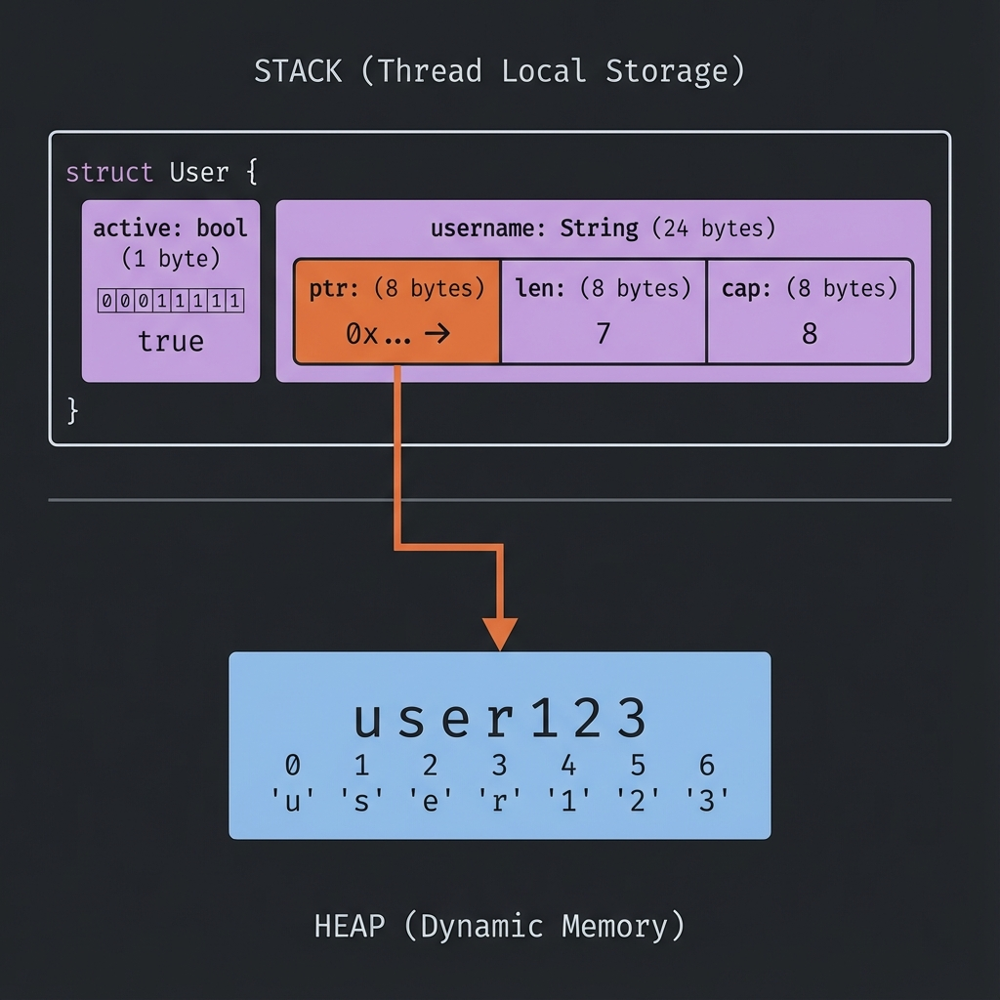

# การสร้าง Struct

## นิยาม Struct

```rust
struct User {
    username: String,
    email: String,
    sign_in_count: u64,
    active: bool,
}
```

- ใช้ `struct` keyword
- ตั้งชื่อแบบ **PascalCase** (ตัวพิมพ์ใหญ่ขึ้นต้นแต่ละคำ)
- แต่ละ field มี `name: Type`

### 📦 Struct Memory Layout



---

## สร้าง Instance

```rust,ignore
fn main() {
    let user1 = User {
        email: String::from("alice@example.com"),
        username: String::from("alice"),
        active: true,
        sign_in_count: 1,
    };

    println!("Username: {}", user1.username);
    println!("Email: {}", user1.email);
}

struct User {
    username: String,
    email: String,
    sign_in_count: u64,
    active: bool,
}
```

---

## เข้าถึงและแก้ไข Fields

```rust,ignore
struct User {
    username: String,
    email: String,
    sign_in_count: u64,
    active: bool,
}

fn main() {
    let mut user1 = User {
        email: String::from("alice@example.com"),
        username: String::from("alice"),
        active: true,
        sign_in_count: 1,
    };

    // อ่านค่า
    println!("Email: {}", user1.email);

    // แก้ไขค่า (ต้อง mut)
    user1.email = String::from("new@example.com");

    println!("New email: {}", user1.email);
}
```

> **หมายเหตุ:** ทั้ง instance ต้องเป็น `mut` ไม่สามารถ mut แค่บาง field ได้

---

## Field Init Shorthand

ถ้าชื่อ parameter ตรงกับ field ไม่ต้องเขียนซ้ำ:

```rust,ignore
struct User {
    username: String,
    email: String,
    sign_in_count: u64,
    active: bool,
}

fn build_user(email: String, username: String) -> User {
    User {
        email,    // แทน email: email
        username, // แทน username: username
        active: true,
        sign_in_count: 1,
    }
}
```

---

## Struct Update Syntax

สร้าง instance ใหม่จาก instance เดิม:

```rust,ignore
struct User {
    username: String,
    email: String,
    sign_in_count: u64,
    active: bool,
}

fn main() {
    let user1 = User {
        email: String::from("alice@example.com"),
        username: String::from("alice"),
        active: true,
        sign_in_count: 1,
    };

    // สร้าง user2 โดยใช้ค่าจาก user1
    let user2 = User {
        email: String::from("bob@example.com"),
        ..user1 // ใช้ค่าที่เหลือจาก user1
    };

    // ⚠️ user1.username ถูก move ไป user2 แล้ว!
    // println!("{}", user1.username); // ❌ Error
    println!("{}", user1.email); // ✅ OK (ไม่ได้ move)
}
```

---

## Tuple Structs

Struct ที่ไม่มีชื่อ field:

```rust,ignore
struct Color(i32, i32, i32);
struct Point(i32, i32, i32);

fn main() {
    let black = Color(0, 0, 0);
    let origin = Point(0, 0, 0);

    println!("R: {}", black.0);
    println!("X: {}", origin.0);
}
```

> **หมายเหตุ:** `Color` และ `Point` เป็นคนละ type แม้จะมีโครงสร้างเหมือนกัน

---

## Unit-like Structs

Struct ที่ไม่มี field:

```rust,ignore
struct AlwaysEqual;

fn main() {
    let subject = AlwaysEqual;
}
```

มีประโยชน์เมื่อต้องการ implement trait โดยไม่ต้องเก็บข้อมูล

---

## Debug Printing

เพิ่ม `#[derive(Debug)]` เพื่อ print struct:

```rust,ignore
#[derive(Debug)]
struct Rectangle {
    width: u32,
    height: u32,
}

fn main() {
    let rect = Rectangle {
        width: 30,
        height: 50,
    };

    println!("{:?}", rect);   // Debug format
    println!("{:#?}", rect);  // Pretty debug format
}
```

Output:

```text
Rectangle { width: 30, height: 50 }
Rectangle {
    width: 30,
    height: 50,
}
```

---

## ลองทำดู! 🎯

1. สร้าง struct `Book` ที่มี title, author, pages
2. สร้าง struct `Point` สำหรับพิกัด 2D
3. ใช้ `#[derive(Debug)]` และ print struct

---

## สรุป

| แนวคิด    | ตัวอย่าง                      |
| --------- | ----------------------------- |
| Define    | `struct Name { field: Type }` |
| Create    | `Name { field: value }`       |
| Access    | `instance.field`              |
| Shorthand | `field` แทน `field: field`    |
| Update    | `..other_instance`            |
| Debug     | `#[derive(Debug)]`            |

👉 ต่อไป: [Methods](./02-methods.md)
