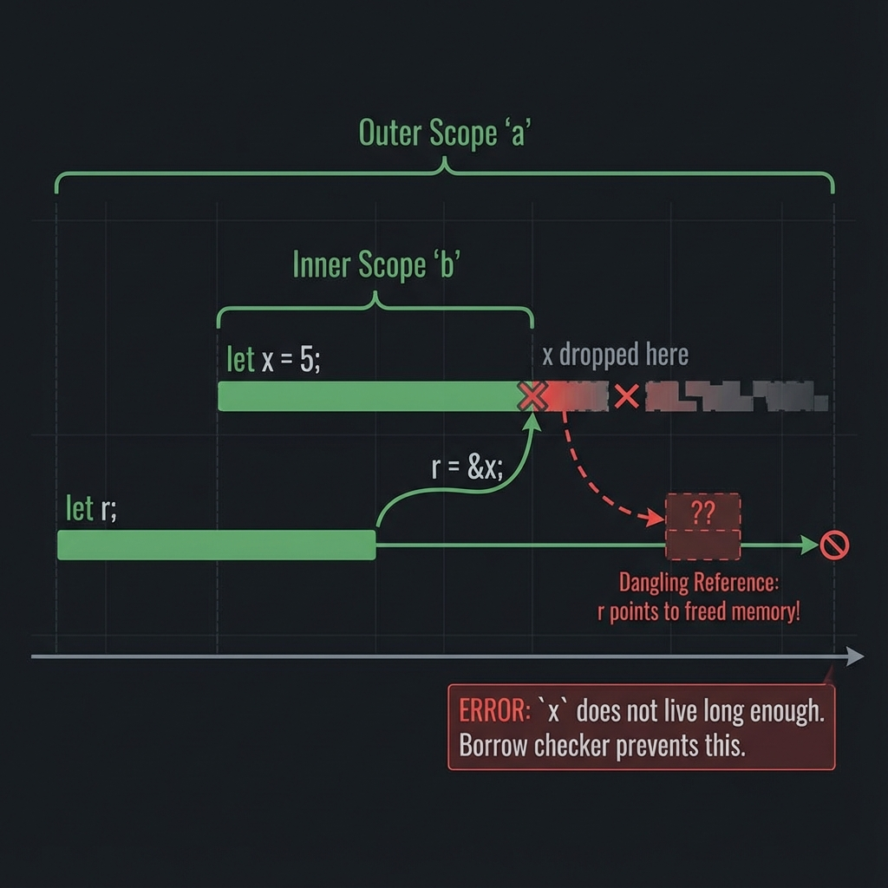

# Lifetimes

**Lifetimes** บอก compiler ว่า references มีอายุนานเท่าไหร่ ป้องกัน dangling references

> ⚠️ **คำเตือน: Lifetime เป็นหัวข้อที่ยากที่สุดใน Rust**
>
> - ❌ อย่าใช้ `'static` เพื่อแก้ทุก error
> - ❌ อย่าเดา lifetime แบบสุ่ม
> - ✅ เข้าใจปัญหาก่อนแก้
> - ✅ ใช้ owned types (String แทน &str) เมื่อสงสัย

### 📋 Lifetime Cheatsheet

| สถานการณ์ | ต้องใส่ Lifetime? | ตัวอย่าง |
|-----------|------------------|----------|
| Return reference จาก function | ✅ ใช่ | `fn foo<'a>(x: &'a str) -> &'a str` |
| 1 input reference | ❌ ไม่ต้อง (elision) | `fn foo(x: &str) -> &str` |
| Method with `&self` | ❌ ไม่ต้อง (elision) | `fn bar(&self) -> &str` |
| Struct เก็บ reference | ✅ ใช่ | `struct Foo<'a> { x: &'a str }` |
| Static string | ❌ ไม่ต้อง | `let s: &'static str = "hello"` |

### 🧠 Mental Model



### 🔧 Common Patterns

```text
1. Input → Output (ใช้ lifetime เดียวกัน)
   fn get_first<'a>(list: &'a [i32]) -> &'a i32

2. Struct เก็บ reference
   struct Parser<'a> { input: &'a str }

3. Multiple lifetimes (แยกคนละช่วง)
   fn foo<'a, 'b>(x: &'a str, y: &'b str) -> &'a str

4. 'static (อยู่ตลอดโปรแกรม)
   const MSG: &'static str = "Hello";
```

## ปัญหา: Dangling Reference

```rust,ignore
fn main() {
    let r;                // declare r
    {
        let x = 5;
        r = &x;           // ❌ x จะหายเมื่อออกจาก scope
    }
    // println!("{}", r); // Error! r points to invalid memory
}
```

```text
+---------------------------------------------------------+
|                 Dangling Reference                      |
+---------------------------------------------------------+
|                                                         |
|  let r; ---------+                                      |
|  {               |                                      |
|    let x = 5; <--+ r points to x                        |
|    r = &x;                                              |
|  } <-- x dropped here!                                  |
|                                                         |
|  r -> invalid memory                                    |
|                                                         |
+---------------------------------------------------------+
```

Rust compiler จะ reject โค้ดนี้เพราะ `x` ไม่อยู่แล้วเมื่อใช้ `r`

---

## Lifetime Syntax

```text
&i32        // reference
&'a i32     // reference with explicit lifetime 'a
&'a mut i32 // mutable reference with lifetime 'a
```

`'a` (อ่านว่า "tick a") คือ **lifetime parameter** บอกว่า reference มีอายุเท่าไหร่

---

## Lifetime ใน Functions

### ปัญหา: Compiler ไม่รู้ว่า return อะไร

```rust,compile_fail
// ❌ Error: missing lifetime specifier
fn longest(x: &str, y: &str) -> &str {
    if x.len() > y.len() {
        x
    } else {
        y
    }
}
```

Compiler ไม่รู้ว่า return value จะอยู่นานเท่า `x` หรือ `y`

### ทางแก้: Lifetime Annotations

```rust
fn longest<'a>(x: &'a str, y: &'a str) -> &'a str {
    if x.len() > y.len() {
        x
    } else {
        y
    }
}

fn main() {
    let string1 = String::from("long string is long");
    let string2 = String::from("xyz");

    let result = longest(&string1, &string2);
    println!("Longest: {}", result);
}
```

**ความหมาย:** Return value จะมีอายุเท่ากับ lifetime ที่สั้นกว่าระหว่าง `x` และ `y`

---

## Lifetime กับ Scope

```rust
fn main() {
    let string1 = String::from("long string is long");

    {
        let string2 = String::from("xyz");
        let result = longest(&string1, &string2);
        println!("Longest: {}", result); // ✅ OK
    }

    // println!("{}", result); // ❌ result ไม่มีแล้ว
}

fn longest<'a>(x: &'a str, y: &'a str) -> &'a str {
    if x.len() > y.len() { x } else { y }
}
```

---

## Lifetime Elision Rules

Compiler มีกฎ 3 ข้อที่เดา lifetime ให้อัตโนมัติ:

### Rule 1: Input Lifetimes

แต่ละ reference parameter ได้ lifetime ของตัวเอง:

```rust,ignore
fn foo(x: &i32)                    // -> fn foo<'a>(x: &'a i32)
fn foo(x: &i32, y: &i32)           // -> fn foo<'a, 'b>(x: &'a i32, y: &'b i32)
```

### Rule 2: Single Input → Output

ถ้ามี input lifetime เดียว ใช้กับ output ทั้งหมด:

```rust,ignore
fn foo(x: &i32) -> &i32            // -> fn foo<'a>(x: &'a i32) -> &'a i32
```

### Rule 3: Methods with &self

ถ้ามี `&self` หรือ `&mut self` ใช้ lifetime ของ self กับ output:

```rust,ignore
impl Foo {
    fn bar(&self, x: &str) -> &str // -> fn bar<'a, 'b>(&'a self, x: &'b str) -> &'a str
}
```

> **ถ้ากฎทั้งหมดไม่เพียงพอ** → Compiler error → ต้องใส่ lifetime เอง

---

## ตัวอย่าง: เมื่อต้องใส่ Lifetime

```rust
// ✅ Elision works - Rule 2
fn first_word(s: &str) -> &str {
    let bytes = s.as_bytes();
    for (i, &item) in bytes.iter().enumerate() {
        if item == b' ' {
            return &s[0..i];
        }
    }
    &s[..]
}

// ❌ Elision fails - must annotate
fn longest<'a>(x: &'a str, y: &'a str) -> &'a str {
    if x.len() > y.len() { x } else { y }
}
```

---

## Lifetime ใน Structs

Struct ที่มี references ต้องมี lifetime annotation:

```rust
struct ImportantExcerpt<'a> {
    part: &'a str,
}

fn main() {
    let novel = String::from("Call me Ishmael. Some years ago...");
    let first_sentence = novel.split('.').next().unwrap();

    let excerpt = ImportantExcerpt {
        part: first_sentence,
    };

    println!("{}", excerpt.part);
}
// excerpt ต้องไม่อยู่นานกว่า novel
```

### Methods on Structs with Lifetimes

```rust,ignore
impl<'a> ImportantExcerpt<'a> {
    fn level(&self) -> i32 {
        3
    }

    // Rule 3 applies: return lifetime = self lifetime
    fn announce_and_return_part(&self, announcement: &str) -> &str {
        println!("Attention: {}", announcement);
        self.part
    }
}
```

---

## 'static Lifetime

`'static` หมายถึง reference อยู่ได้**ตลอดโปรแกรม**:

```rust
let s: &'static str = "I have a static lifetime.";
```

**String literals** ทั้งหมดมี `'static` lifetime เพราะเก็บใน binary

### ระวัง!

อย่าใช้ `'static` เพื่อ "แก้" lifetime errors โดยไม่เข้าใจ:

```rust,compile_fail
// ❌ Bad: ใช้ 'static แบบผิดๆ
fn get_str() -> &'static str {
    let s = String::from("hello");
    &s  // ❌ s จะถูก drop!
}

// ✅ Good: return owned String
fn get_str_good() -> String {
    String::from("hello")
}
```

---

## Multiple Lifetimes

บางครั้งต้องใช้หลาย lifetimes:

```rust
fn longest_with_announcement<'a, 'b>(
    x: &'a str,
    y: &'a str,
    ann: &'b str,
) -> &'a str {
    println!("Announcement: {}", ann);
    if x.len() > y.len() { x } else { y }
}
```

---

## Lifetime Bounds

ใช้กับ generics:

```rust
fn longest_with_trait<'a, T>(x: &'a str, y: &'a str, ann: T) -> &'a str
where
    T: std::fmt::Display,
{
    println!("Announcement: {}", ann);
    if x.len() > y.len() { x } else { y }
}
```

---

## ลองทำดู! 🎯

1. เขียน struct ที่มี lifetime annotation
2. เขียน function ที่ต้องใส่ lifetime
3. ลองตัด lifetime ออกและดู compiler error

---

## สรุป

| แนวคิด     | ตัวอย่าง                            |
| ---------- | ----------------------------------- |
| Annotation | `&'a str`                           |
| Function   | `fn foo<'a>(x: &'a str) -> &'a str` |
| Struct     | `struct Foo<'a> { x: &'a str }`     |
| 'static    | อายุตลอดโปรแกรม                     |
| Elision    | Compiler เดาให้                     |

### กฎ Elision

1. แต่ละ input ได้ lifetime ตัวเอง
2. input เดียว → ใช้กับ output
3. `&self` → output ใช้ lifetime ของ self

👉 ต่อไป: [บทที่ 11: Modules & Packages](../ch11-modules/README.md)
